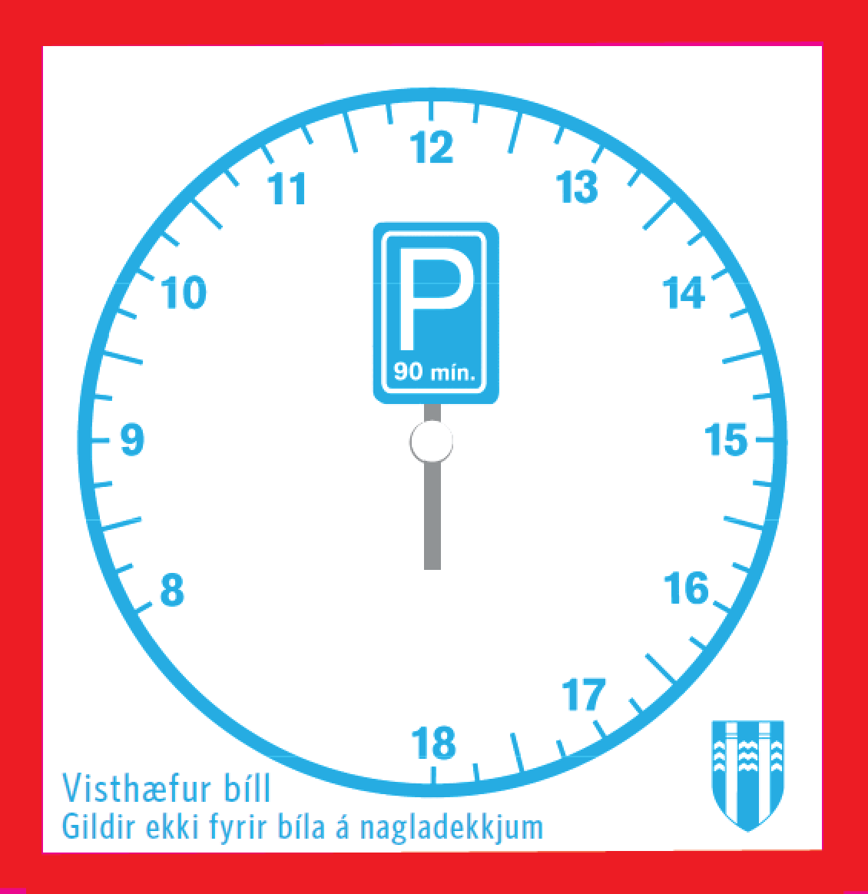
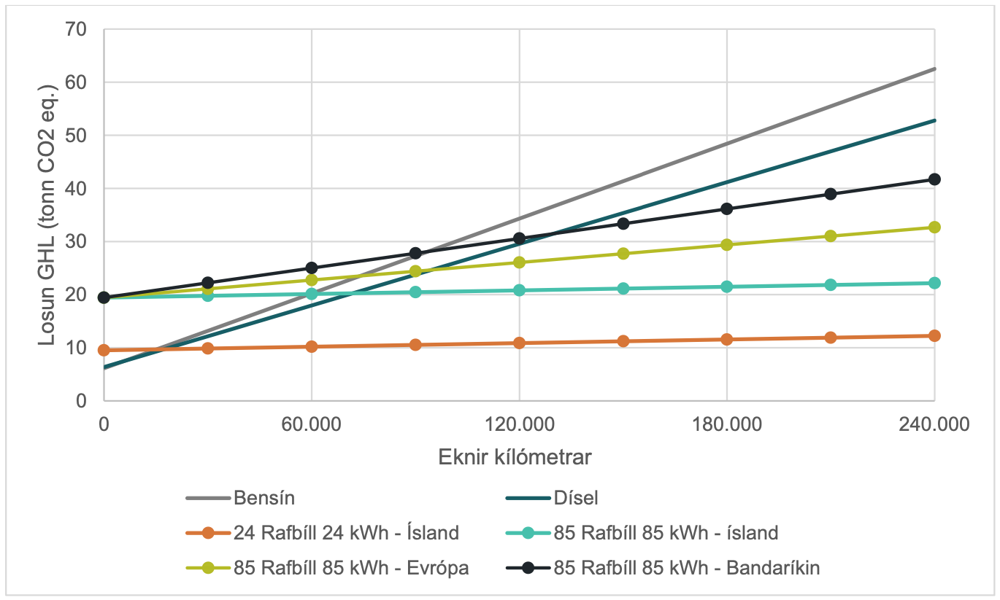
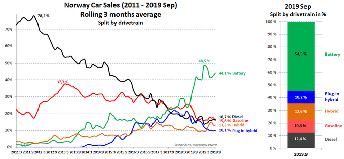
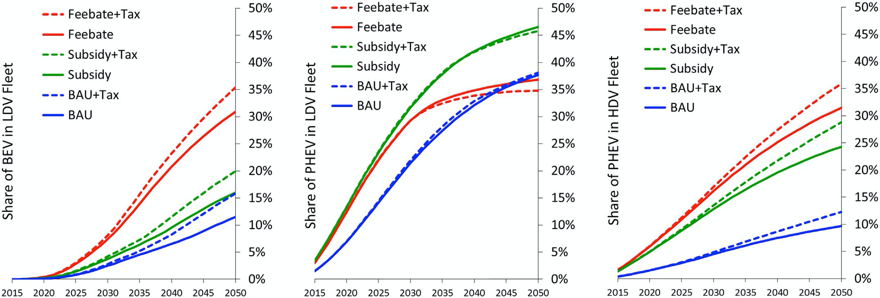
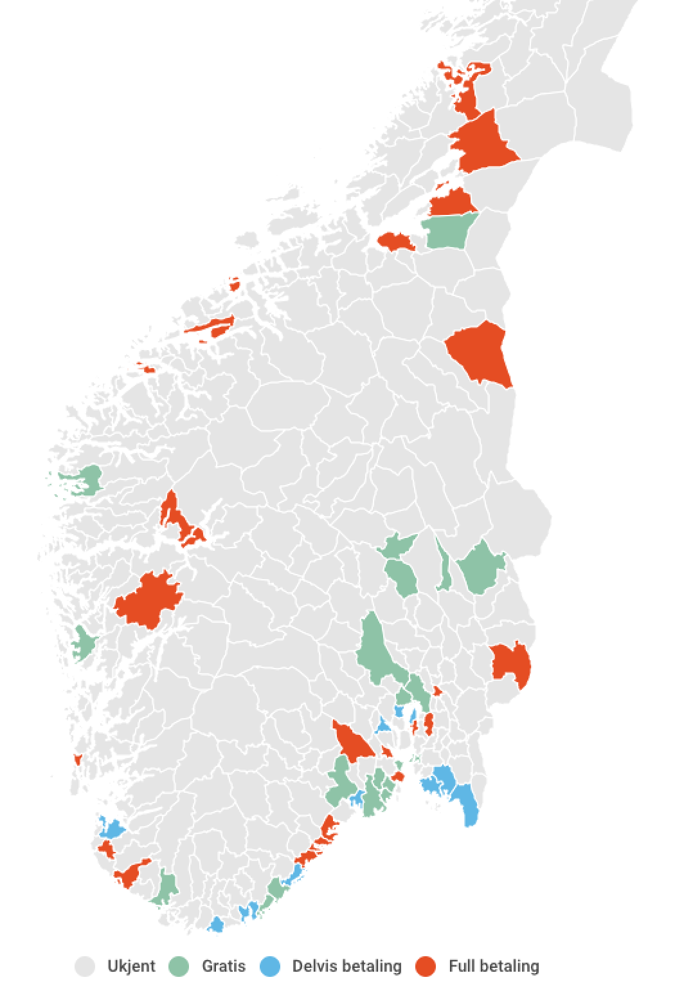

# Vistskífa fyrir hreinorkubíla

Frá og með 1. janúar 2017 hefur visthæfum bifreiðum staðið til boða sérstök
skífa sem veitir 90 mínútna gjaldfrjálsan aðgang að bílastæðum á P1-4 svæðum[^vistskífa].

Eftirfarandi bifreiðar hafa rétt á vistskífu

- Bifreiðar með rafgeymi/brunahreyfil, sem gefur frá sér minna en 50 g
  koldíoxíði pr. km. í blönduðum akstri (tengitvinnbílar) og skráða eigin þyngd
  minni en 1600 kg.
- Bifreiðar með brunahreyfil, sem ganga fyrir metani og skráða eigin þyngd
  minni en 1600 kg.
- Bifreiðar sem ganga eingöngu fyrir rafmagni, rafgeymabílar og skráða lengd
  minni en 5 m.
- Bifreiðar sem ganga fyrir vetni og skráða lengd minni en 5m.

Gjaldfrelsi fellur niður ef bifreið er á nagladekkjum. Flestir tvinnbílar falla ekki undir þessa skilgreiningu. 

Gildistími þessa ívilnana sem og gildi vistskífa fellur niður í lok árs 2019.

Bifreiðar skráðar á eigendur með lögheimili utan Reykjavíkur hafa einnig
heimild til að fá og nota skífuna. Samkvæmt Alberti Heimissyni deildarstjóra
útideildar Bílastæðasjóðs liggja ekki fyrir gögn um hversu hátt hlutfall
bifreiða nýta sér fríðindin, en skífunum hefur fyrst og fremst verið dreift af
bílaumboðum.

{ width=50% }

# Orkuskipti bílaflota

Hreinorkubílar menga minna og draga úr notkun á innfluttum orkugjöfum.

Þó að meiri losun fylgi framleiðslu rafbíla en sambærilegra bifreiða að jafnaði
er talsverður umhverfislegur ávinningur af því að endurnýjun á bílaflota
Íslands verði að sem mestu með bifreiðum knúnum hreinum og innlendum
orkugjöfum. Innan raforkukerfisins hér á landi er losun kolefna af hverri
kílówattstund aðeins 9,3g af CO2.

Samkvæmt skýrslu Orku náttúrunnar er Tesla Model S bifreið með jafnan útblástur
á við sambærilegan bensínbíl þegar báðir bílar hafa verið eknir 60.000
km[^kolefnisfotspor-rafbila]. Eftir það heldur bensínbíllinn áfram að menga en
ekki rafbíllinn. Eftir 240.000 km akstur hefur rafbíll mengað um tvöfalt meira
í bandarísku raforkukerfi en íslensku og sambærilegur bíll knúinn díselolíu
hefur mengað um þrefalt meira í íslensku raforkukerfi.

Bæði menga rafbílar minna og íslenskt raforkukerfi gerir rafbíla enn grænni en í flestum öðrum löndum.

Evrópusambandið gerir kröfur á bílaframleiðendur um að meðalútblástur þess bílaflota sem er framleiddur sé innan við ákveðið útblástursgildi (CO2g per kílómeter í blönduðum akstri). Árið 2020 verða þessi viðmið talsvert strangari og vænta greinendur aukins framboðs á rafbílum í fleiri þyngdar- og verðflokkum á næsta ári[^matthias][^eu-fleet]. 

Hlutur hreinorkubifreiða hefur vaxið ört á undanförnum árum hér á landi. Hlutur rafbíla í nýskráningum á Íslandi á þriðja ársfjórðungi þessa árs var 9,5%. Séu tengiltvinnbílar taldir með er þetta hlutfall 22,6%. 

Í Noregi var hlutur hreinna rafbíla í nýskráningum 44,1% í þriðja ársfjórðungi 2019[^noregur-ev-sales]. 

Til samanburðar eru raf- og tengiltvinnbílar aðeins með 3% hlutdeild
nýskráninga í Evrópu í ágúst 2019[^europe-ev-sales]. 

Noregur og Ísland eru þess aðnjótandi að vatnsfallsorka er stór hluti af
raforkukerfinu og aðstæður sérstaklega góðar fyrir ívilnanir sem stuðla að
orkuskiptum. Þessar tvær þjóðir hafa gengið hvað lengst í ívilnunum til að
stuðla að orkuskiptum bílaflota.

Í lok 2018 voru raf- og tengiltvinnbílar samanlagt undir 3% af fólksbílaflota
landsins.

Til að áætla þróun bílaflota með tilliti til hreinorkuvæðinga var útbúið líkan
sem tekur mið af sögulegri endurnýjun bílaflota á árunum 2008 til 2018.

Samkvæmt spálíkaninu verður hlutur hreinorkubíla í fólksbílaflota
höfuðborgarsvæðisins 8% árið 2020. Þaðan tvöfaldast hlutfallið fyrir árið 2025 og verður 27% árið 2030. 

Forsendur í spálíkaninu:

* Hlutfall nýskráninga heldur áfram að hækka um 4% á hverju ári, sem er meðalhækkun í hlut nýskráninga síðan árið 2015.
* Hlutur hreinorkubíla heldur áfram að vera 28% hærri á höfuðborgarsvæðinu en á landinu.
* Ívilnanir stjórnvalda fyrir raf- og tengiltvinnbíla verði áfram óbreyttar.
* Áform um bann á nýskráningum á bensín- og dísilfólksbílum árið 2030 verði að veruleika og þá verði hlutur hreinorkubíla í nýskráningum 100%.
* Endurnýjun fólksbílaflota á höfuðborgarsvæði verði 8.244 nýir bílar og 4.073 afskráðir á ári hverju. Þetta er meðaltal endurnýjunar á tímabilinu 2008 til 2018. Erfitt er að spá fyrir um hraða endurnýjunar á bílaflota. Eins og sást á árunum 2008 til 2011 er hægt að fresta endurnýjun þegar efnahagslegar aðstæður eru slakar. Aftur á móti verður endurnýjun mjög mikil þegar aðstæður batna. 

---

Árið 2018 var gerð ítarleg greining á endurnýjun bílaflota miðað við mismunandi
blöndur af ívilnunum. Skýrslan nefnist *Macroeconomic effects of fiscal
incentives to promote electric vehicles in Iceland: Implications for government
and consumer costs*[^brynhildur]. Hlutur raf- og tengiltvinnbíla í bílaflota er
birtur undir seríunni *BAU* („business as usual“) sem vísar til þeirrar blöndu
ívilnana sem enn er í gildi. 

Samkvæmt grafinu að ofan úr skýrslunni má áætla um 14% hlut hreinorkubíla árið 2025 og 39% árið 2040. 

Spálíkan þessarar skýrslu svipar til þess sem er í *Macroeconomic effects [...]*. Munurinn felst helst í eftirfarandi atriðum:

1. *Macroeconomic effects [...]* gerir ekki ráð fyrir banni á nýskráningum bensín- og dísilbíla árið 2030. Það gerir líkanið hér.
2. *Macroeconomic effects [...]* gerir ekki grein fyrir tölum eða útreikningi á bak við förgun. Líkanið í þessari skýrslu styðst við meðtöl áranna 2008 til 2018. 
3. *Macroeconomic effects [...]* reiknar hlutdeildaraukningu rafbíla útfrá fallandi verði en þessi skýrsla gerir einfaldlega ráð fyrir að meðtaltals prósentu hækkun áranna 2015-2019 haldi áfram óbreytt fram að árinu 2030 þegar hlutfall nýskráninga verður 100% í kjölfar lagabreytinga.
4. Einungis er litið til Höfuðborgarsvæðisins í þessu líkani þar sem hlutur raf- og tengiltvinnbíla er áætlaður 28% hærri í flota. *Macroeconomic effects [...]* greinir hinsvegar flota landsins alls.

| Ár   | Hlutur     | Macroeconomic effects [...] |
|------|------------|-----------------------------|
| 2020 | 8%         | -                           |
| 2025 | 15%        | 14%                         |
| 2030 | 25%        | -                           |
| 2040 | 50%        | 39%                         |
| 2050 | 68%        | -                           |

# Gjaldtaka bílastæða og hreinorkubíla í nágrannaþjóðum

Engin ítarleg greining liggur fyrir um ívilnanir tengdar bílastæðum í Norður Evrópskum borgum. 

Áætla má að niðurfelling á gjaldskyldu bílastæða fyrir hreinorkubíla sé aðeins tilgreind ef slík fríðindi eru í boði, þ.e.a.s á vefum borga um bílastæði má gera ráð fyrir því að ekki séu nein sérstök fríðindi í boði fyrir hreinorkubíla nema þess sé sérstaklega getið. 

Engar borgir með sérstakar ívilnanir á gjaldtöku hreinorkubíla í bílastæði
fundust í Þýskalandi, Hollandi, Belgíu, Danmörku og Svíþjóð. Margar borgir hafa
hinsvegar breytt hefðbundnum bílastæðum í hleðslustöðvar þar sem gjaldheimtan
tekur mið af raforkunotkun[^stokkhólmur].

## Noregur

Noregur hefur verið leiðandi í niðurgreiðslum og fríðindum fyrir rafbíla. 

Fram til ársins 2017 var sveitarfélögum í Noregi óheimilt að innheimta
bílastæðagjöld af rafbílum. Löggjafaþingið í Noregi samþykkti árið 2017 að
heimila gjaldtöku allt að 50% af gjaldskrá bílastæða sveitarfélags ef um
bifreið með engan púströrsútblástur er að ræða[^noregur-parking-policy].
Samkvæmt yfirliti vefsíðunnar elbil.no frá júní 2019 eru enn fjöldi stærri bæja
og borga með fulla gjaldskyldu fyrir rafbíla, sum þeirra þó með ýmiskonar
sértækum undanþágum sem varða staðsetningu eða tíma dags. Mörg sveitarfélög
hafa tekið upp 50% regluna nú þegar og enn önnur hafa kosið að innheimta engin
gjöld.

{ width=80% }

Til dæmis eru Oslo, Bergen og Lillehammer með enga gjaldskyldu fyrir rafbíla.
Stavenger og Drammen styðjast við 50% regluna. Harstad, Voss, Trondheim,
Alesund auk a.m.k. 30 annara eiga eftir að aðlaga sínar reglur að 50% reglunni
og eru ýmist með fulla gjaldskyldu eða sérstakar undanþágur sem samræmast ekki
hinum nýju reglum. Talið er að fyrir lok ársins muni flest sveitarfélög
samræmast 50% reglunni.

## Bretland

Richmond og Chelsea hverfi í London hafa mismunað gjaldtöku bílastæða eftir orkugjafa bifreiðar með það fyrir sjónum að auka staðbundin loftgæði og draga úr losun[^chelsea]. Bæði Richmond og Chelsea eru með ítarlega flokkun ökutækja og fínstillta verðskrá á bílastæðapassa ætlaða íbúum. Richmond gefur gjaldfrálsa bílastæðapassa fyrir útblásturslausar bifreiðir[^richmond]. 

## Holland

Árið 2012 var frumvarp um að heimildir sveitarfélaga til að mismuna gjaldtöku bílastæða eftir orkugjafa bifreiða fellt[^parking-policy]. 

## Madrid

Madrid hefur takmarkað aðgengi mengandi bifreiða að miðbæjarsvæði. Rafbílar fá gjaldfrjáls bílastæði við götur en tengiltvinnbílar fá 50% afslátt. Aðgangasstýring bílastæða og heimild til að aka um götur byggir á flokkun bifreiða sem tekur mið af aldri bíls og orkugjafa. Myndavélakerfi hefur verið sett upp til að sekta og fylgja reglunum eftir[^madrid].  

## Samantekt um ívilnanir nágrannaborga

Hvergi fundust borgir þar sem lífeldsneytis-, tengiltvinn- eða tvinnbílar fá
niðurfellingu á gjaldtöku í bílastæði þar sem almenn gjaldtaka á sér stað. Í
Noregi hefur ríkið tekið skref til baka og aftur heimilað sveitarfélögum
gjaldtöku rafbíla í bílastæði, þó með þeirri kröfu að þeir fái a.m.k. 50%
afslátt af gjöldum bensín- og dísilbíla. Richmond og Chelsea bjóða afslætti af
bílastæðapassa íbúa en veita annars ekki gjaldfrjáls bílastæði. Reykjavík hefur
víðtækustu niðurfellingar á gjöldum til visthæfra bíla af öllum borgum sem voru
skoðaðar.

Þess má geta að gjaldtaka og stýring á notkun bílastæða eykst yfirleitt eftir
því sem borgir stækka og verðmæti á borgarlandi
eykst[^real-price-of-parking-policy]. Íbúum fjölgar í flestum borgum í heiminum
og þar af leiðir aukin krafa um stýringu og gjaldtöku bílastæða. Eftir því sem
stýring á bílastæðum færist í auka vex einnig tekjustofn bílastæða, sem er
einmitt tilfellið fyrir Reykjavíkurborg. 

# Tekjur Reykjavíkurborgar af gjaldtöku bílastæða

Aðal tekjur Bílastæðasjóðs koma frá miðasölu, stöðumælum, bílastæðahúsum og sektum. 

Vistskífur veita gjaldfrjálsan aðgang að P1-4 svæðum þar sem gjaldtakan er um stöðumæla, miðasölu og öpp á borð við Leggja.is. 

Heildartekjur útideildar námu 388 m.kr. fyrri helming þessa árs. Þar eru undanskildar tekjur frá bílastæðahúsum.

Eftirfarandi þættir tengdir vistskífum hafa áhrif á tekjur borgarinnar:

1. **Notendahlutfall**: Mjög ólíklegt er að allir þeir sem hafa rétt á að fá vistskífu séu meðvitaðir um fríðindinn og sækist eftir skífu[^athugasemd-vistskifa].
2. **Aukin aðsókn**: Samkvæmt hagfræðikenningum eykst eftirspurn við lækkandi verð. Mögulegt er að þeir sem fái ókeypis bílastæði sjái ástæðu til að nota stæðinn oftar sem dregur þá mögulega úr aðsókn þeirra sem mundu borga og framboði lausra stæða. Ekki verður gerð tilraun til að meta þessi áhrif, en óhætt er að gera ráð fyrir að meðgjöf sé vanáætluð útaf þessu atriði.
3. **Reglur**: Að víkka eða þrengja skilyrði fyrir vistskífuréttindum breytir þeim fjölda bifreiða sem hafa rétt á vistskífu og þar með fjölda bíla sem leggja í gjaldfrjáls stæði.
4. **Hlutur hreinorkubíla í bílaflota**, sérstaklega höfuðborgarsvæðisins: Eftir því sem hlutur bifreiða sem hafa rétt á vistskífum eykst dragast tekjur Bílastæðasjóðs saman. Til að meta þessi áhrif á komandi árum var búið til spálíkan. 

Forsendur fyrir áætlun um tekjutap vegna ívilnana á gjaldskyldum bílastæðum eru eftirfarandi:

1. Tekjur af miðasölu á P1-4 svæðum verði 776 m.kr. á ári og haldast þannig til ársins 2050. Miðað er við tvöfaldar tekjur af P1-4 svæðum á fyrri helming þessa árs samkvæmt fjárhagsreikningum borgarinnar fyrir útideild Bílastæðasjóðs. 
2. Notendalutfall vistskífu er 75% og óbreytt næstu ár eftir því sem hlutur rétthafa vistskífa eykst. 

Fórnartekjur Bílastæðasjóðs á þessu ári nema 42 m.kr., yfir 93 m.kr. árið 2025 og 364 m.kr. árið 2045. Athuga að ekki er um uppsafnaða meðgjöf að ræða heldur meðgjöf á hverju ári fyrir sig. 

Gjaldskyld bílastæði á svæðum P1-4 eru 3.379 talsins. Öfugt við ívilnanir ríkisins sem varða niðurfellingu virðisauka við öflun raf- og tengiltvinnbíla er hér um að ræða meðgjöf á takmarkaðri auðlind: borgarland ætlað kyrrstæðum bílum. 

[^kolefnisfotspor-rafbila]: [Kolefnisfotspor rafbila vid islenskar adstaedur, 2019](https://www.on.is/wp-content/uploads/2019/07/kolefnisfotspor-rafbila-vid-islenskar-adstaedur-on-030719.pdf)
[^noregur-ev-sales]: [https://twitter.com/eyaven/status/1179153694010613761](https://twitter.com/eyaven/status/1179153694010613761)
[^europe-ev-sales]: [EV Sales - Europe August 2019](http://ev-sales.blogspot.com/2019/09/europe-august-2019.html)
[^brynhildur]: [Macroeconomic effects of fiscal incentives to promote electric vehicles in Iceland: Implications for government and consumer costs](https://www.sciencedirect.com/science/article/pii/S0301421517308583#!)
[^vistskífa]: [Visthæfir bílar á reykjavik.is](https://reykjavik.is/thjonusta/visthaefir-bilar)
[^noregur-parking-policy]: [Få landsoversikt over gratis elbilparkering](https://elbil.no/norge-rundt-fa-oversikt-over-gratis-parkering/)
[^madrid]: [Everything you need to know about the central Madrid restricted access area](https://endesavehiculoelectrico.com/en/espanol-todo-sobre-el-area-de-acceso-restringido-madrid-central/)
[^stokkhólmur]: [Stockholm Free Electric Parking](https://www.flickr.com/photos/38607288@N03/3836164473/)
[^athugasemd-vistskifa]: Samkvæmt samtali við Kjartan Loga Sigurjónsson bílastæðavörð er talsvert hlutfall hreinorkubíla sem eiga rétt á vistskífu ekki með hana til sýnis í rúðu bílsins. Skýrsluhöfundur er eigandi rafbíls götuskráður agúst 2018 og vissi ekki af vistskífunni fyrr en nú. Dreifing, meðvitund og notkun vistskífunnar mætti greina betur.
[^eu-fleet]: [EU CO2 Emission Standards for Passenger Cars and Light-commercial Vehicles](https://theicct.org/sites/default/files/publications/ICCTupdate_EU-95gram_jan2014.pdf)
[^matthias]: [How OEMs are set to meet EU CO2 targets](https://www.schmidtmatthias.de/post/how-oems-are-set-to-meet-eu-co2-targets)
[^parking-policy]: [Urban parking policy in Europe: A conceptualization of past and possible future trends](https://www.sciencedirect.com/science/article/pii/S0965856415000221#b0240 )
[^chelsea]: [Royal Borough: Parking permit prices and refunds](https://www.rbkc.gov.uk/parking-transport-and-streets/residents/parking-permit-prices-and-refunds)
[^richmond]: [Richmond: Residents parking permit prices](https://www.richmond.gov.uk/resident_parking_permit_costs)
[^real-price-of-parking-policy]: [The real price of parking policy, 2011](https://www.sciencedirect.com/science/article/pii/S0094119011000155#!)
